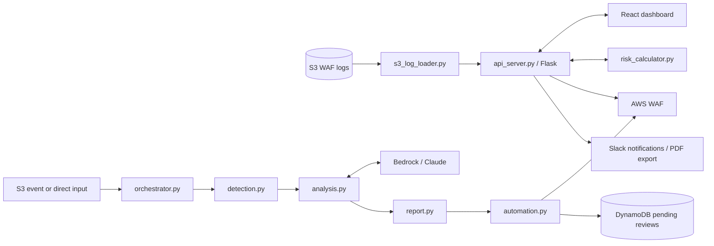
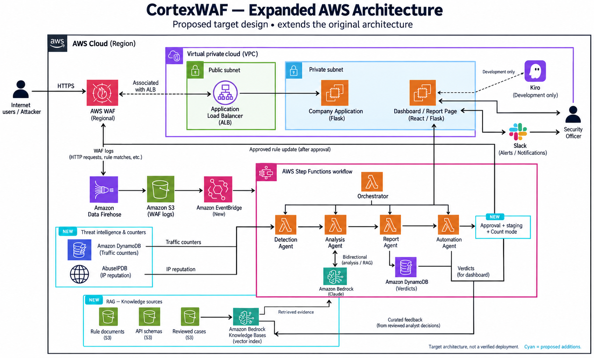
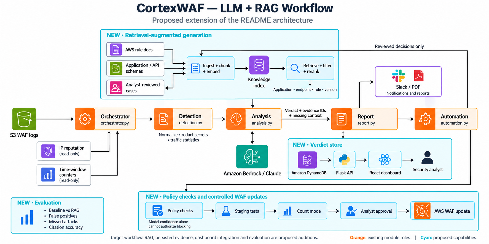

# CortexWAF

**AI-driven AWS WAF log analysis and automated rule management.**
CortexWAF loads AWS WAF logs, displays attack statistics, and supports rule management through a React dashboard. A separate Amazon Bedrock / Claude pipeline classifies events and routes them to blocking or review. The proposed next stage connects these paths with retrieval-augmented generation (RAG), cited evidence, and analyst feedback.


<!-- TODO: replace with your own hosted badges or remove -->


> 🥇 Built at MegazoneCloud's internal Megathon — 1st place. <!-- TODO: confirm exact event name / ranking / # of teams -->

---

## Demo

<!-- TODO: add a short GIF of the dashboard + rule-apply flow, and 2–3 screenshots. This is the single highest-impact addition for recruiters. -->

| Real-time dashboard | WAF rule management |
| --- | --- |
| _screenshot_ | _screenshot_ |

---

## Why it exists

AWS WAF produces high-volume logs, but deciding *which* managed rules to enable — and quantifying the risk you're carrying by not enabling them — is manual, slow, and judgment-heavy. CortexWAF closes that loop:

1. **Collect** WAF logs from S3 (gzip, auto-decompressed).
2. **Detect** attack signatures (SQLi, XSS, command injection, path traversal, file inclusion).
3. **Score** current risk on a dynamic 0–100 scale.
4. **Analyze** events with Bedrock / Claude. Dashboard rule cards currently use templates and log statistics; connecting them to LLM verdicts is planned.
5. **Apply / remove** rules through `boto3`, with the risk score updating live as rules toggle.
6. **Notify & report** — Slack alerts and a downloadable PDF report.

## Architecture

### Current code paths

The repository contains two separate paths:



The analysis modules expose Lambda handlers, and `test_local.py` chains the stages locally. The repository does not include a Step Functions state-machine definition. The dashboard currently generates its own rule cards rather than reading persisted LLM verdicts. The original overview above illustrates infrastructure intent, not a verified deployment.

### Proposed expanded AWS architecture



This target design extends the original architecture with knowledge retrieval, traffic counters, persisted analysis results, and an approval and testing path for WAF updates. Managed AWS services are shown separately from VPC application compute. Cyan highlights proposed capabilities; the diagram is conceptual rather than deployable infrastructure configuration.

### Proposed LLM + RAG workflow



1. **Prepare evidence:** normalize events, redact secrets, and calculate actual traffic statistics. IP reputation and counters enrich the Detection stage.
2. **Retrieve context:** ingest rule documentation, application/API schemas, and analyst-reviewed incidents; filter retrieval by application, endpoint, rule, and version.
3. **Analyze:** provide retrieved evidence to Bedrock and return a verdict, source references, and missing context.
4. **Review:** persist results and expose them through Flask to the React dashboard. Only analyst-reviewed decisions enter the knowledge collection.
5. **Evaluate changes:** validate proposed rules, test in staging, observe in Count mode, and obtain approval before enabling blocking.
6. **Measure:** compare the existing prompt with RAG using labeled cases, false positives, missed attacks, and citation accuracy.

The workflow image summarizes these connections; evidence retrieval feeds Analysis, enrichment feeds Detection, and curated feedback originates from the security analyst. RAG and these integrations are not implemented by this documentation update. Existing automatic blocking uses the model verdict and confidence threshold; the proposed policy checks replace confidence-only authorization. The prompt currently names investigation tools, but their execution loop is not implemented.

## Risk scoring model

The dashboard uses a **heuristic, dynamic risk score**. It is not a calibrated probability or a measured reduction in attacks. WCU represents processing capacity, not protection quality; future evaluation should use labeled traffic outcomes.

- **Ceiling** — current risk with no AI rules applied.
- **Floor** — minimum reachable risk if every recommended rule is applied.
- **Per-rule weight** — implementation-specific heuristics combine rule importance, WCU, and traffic statistics; see `risk_calculator.py`.
- **Live update** — applying a rule subtracts from the score, removing adds back, so the operator sees the trade-off in real time.

## Key features

- **Real-time dashboard** — geographic attack map, hourly attack timeline, monthly attack-type breakdown.
- **Rule management** — template-based rule cards with one-click apply/remove and dynamic risk recalculation. Evidence-backed LLM recommendations are planned.
- **S3 log pipeline** — automatic collection and gzip handling (up to 1,000 recent logs).
- **Pattern-based detection** — SQLi, XSS, command injection, path traversal, file inclusion.
- **Slack alerting + PDF reporting** — operational notifications and shareable reports.

## Tech stack

**Backend** — Python 3.8+, Flask, boto3, Amazon Bedrock (Claude), ReportLab, AbuseIPDB API
**Frontend** — React 18, Axios, Leaflet (maps), Recharts (charts)
**Infra** — AWS WAF, S3, Step Functions

## Getting started

### 1. Install

```bash
pip install -r requirements.txt
cd frontend && npm install && cd ..
```

### 2. Configure

Create a `.env` file (all values are placeholders — never commit real credentials):

```env
AWS_REGION=ap-northeast-2
WAF_ARN=<your_waf_arn>
WAF_NAME=<your_waf_name>
WAF_ID=<your_waf_id>
BEDROCK_MODEL=<your_bedrock_model_id>
PENDING_BLOCKS_TABLE=pending_blocks

ABUSEIPDB_API_KEY=<your_abuseipdb_api_key>

# S3 WAF log source
USE_S3_LOGS=true
S3_BUCKET=<your_bucket>
S3_BUCKET_NAME=<your_waf_log_bucket>
S3_REGION=ap-northeast-2

# Prefer AWS CLI config or an IAM role over static keys
# AWS_ACCESS_KEY_ID=<optional>
# AWS_SECRET_ACCESS_KEY=<optional>
```

### 3. Run

```bash
python api_server.py       # backend  → http://localhost:5000
cd frontend && npm start   # frontend → http://localhost:3000
```

> Windows helper scripts (`start.bat`, `stop.bat`, `restart.bat`) are also included.

## API reference

<details>
<summary>Endpoints</summary>

**Data**
- `GET /api/geographic-data` — attacks by region
- `GET /api/hourly-attacks` — hourly attack volume
- `GET /api/monthly-attack-types` — attack types by month
- `GET /api/logs` — WAF log list
- `GET /api/rules/before` — current rules
- `GET /api/rules/after` — generated rule cards (currently template-based)

**Rule management**
- `GET /api/risk-calculation` — risk breakdown
- `POST /api/apply-rule` — apply a rule
- `POST /api/remove-rule` — remove a rule

**Misc**
- `GET|POST /api/theme` — theme
- `GET /api/download-report` — PDF report

</details>

## Testing

```bash
python test_local.py
python tests/test_s3_connection.py
python tests/test_attack_detection.py
```

## License

MIT — see [LICENSE](LICENSE). <!-- TODO: confirm a LICENSE file actually exists in the repo -->

## Author

**Siyeon (Ella) Park** — Security Architect, MegazoneCloud
[GitHub](https://github.com/ellasypark) <!-- TODO: add LinkedIn -->
